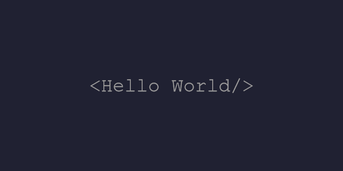

  

# Hailing from the shadows, I am the Dark Knight! 🦇

## Who Am I? 🦇

In the shadows of Gotham, I wield the power of **Python**, crafting code that strikes like a bat. With expertise in **HTML**, **CSS**, **JavaScript**, and **React**, I thrive on unraveling complex challenges and developing innovative solutions. 

- 🌱 Currently honing my skills in: **the art of stealthy coding**
- 🌍 Based in: **the dark alleys of Gotham City**
- ⚡ Fun fact: **When the city sleeps, I code... because I am Batman!**

### Join Me in My Quest! 🚀
Explore my repositories, provide feedback, and let’s create something amazing together!

### Quote of the Dark Knight 🦇
*"It's not who I am underneath, but what I do that defines me."*

### Badges

<b>My Arsenal 📊</b>

<!-- ## Fuel the Batmobile ❤️

If you appreciate my work, consider fueling the Batmobile with a cup of coffee:

<ul style="list-style-type: none; margin: 0;">
<li style="display: inline-block; margin-right: 0.25rem;"></li>
<li style="display: inline-block; margin-right: 0.25rem;"></li>
</ul> -->
